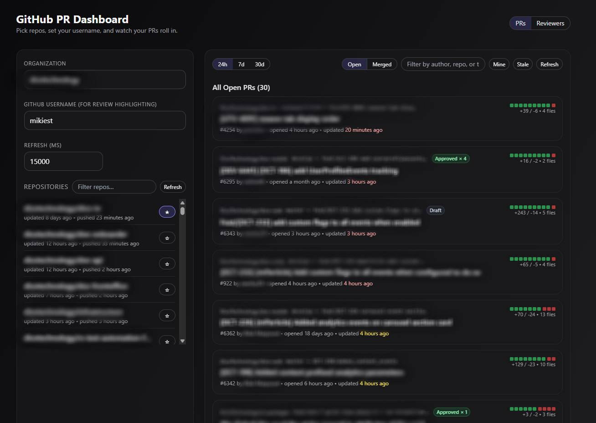

# GitHub PR Dashboard

Lightweight dashboard to keep an eye on pull requests across your favorite org repos. It’s vibe coded and built for folks who just want the signal without the fluff.



## What it does

* Track open or recently merged PRs with author, status, diff stats, pins, and filters for “Mine” or “Stale”.
* Highlight when you’re requested for review and surface recently merged work.
* Rank top reviewers over the last 24h, 7d, or 30d using GitHub’s GraphQL API, complete with a dedicated Reviewers view.

## Stack

* **Client**: React, TypeScript, Vite, Tailwind, React Query, Framer Motion.
* **Server**: Node.js, TypeScript, Express, `gh api graphql` under the hood.

## Setup

1. Install dependencies and start both apps:
   ```bash
   npm install
   npm run dev
   ```
   * API: `http://localhost:4000`
   * App: `http://localhost:5174`
2. (Optional) Run separately:
   ```bash
   cd server && npm run dev
   cd client && npm run dev
   ```

## Configure access

1. Copy `server/.env.example` to `server/.env` and tweak values if needed (org slug, ports, limits).
2. Log in with the GitHub CLI so the server can query data:
   ```bash
   gh auth status
   gh auth login -s=user -s=read:user -s=repo
   ```
   The extra `repo` scope is what lets the dashboard pull the reviewer leaderboard data.

## Using the dashboard

1. Enter your org and GitHub username (for highlight purposes only).
2. Favorite repos via the picker; results persist in your browser.
3. Browse PRs, toggle open/merged, search, pin important ones, or jump to the reviewers tab for leaderboard vibes.

## Troubleshooting

* Make sure the server logs “API listening on http://localhost:4000”.
* Install the GitHub CLI and set `GH_BIN` in `.env` if it isn’t on your PATH.
* If rate-limited, increase the refresh interval or reduce the repo list.

Have fun and keep shipping. ❤️

## 📝 License

MIT
